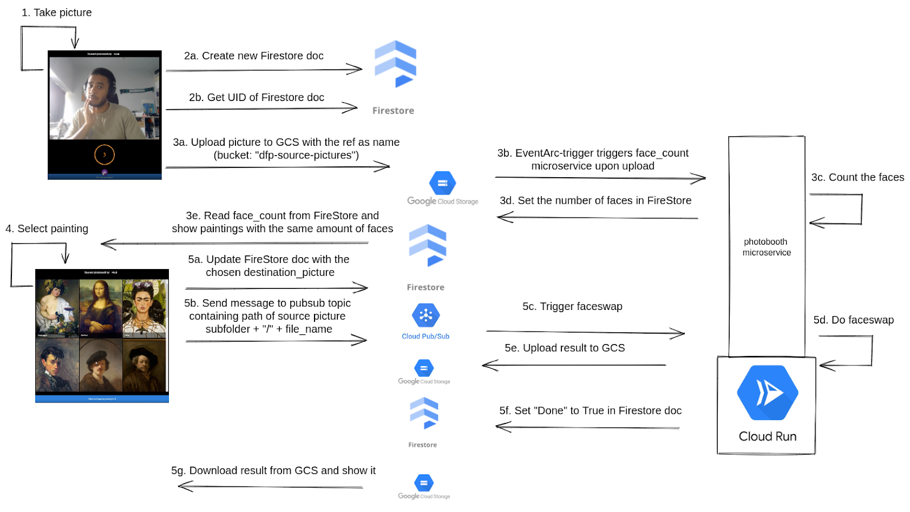

## General architecture: 

## Buckets:

There are 3 buckets used:

- **dfp-source-pictures**: the pictures that are taken with the photo-booth should be uploaded from
the frontend in this bucket. This will automatically trigger the cloud run service part that detects the faces.
IMPORTANT: there should be a sub folder structure in this bucket, where each folder represents a
certain booth/museum (depending on how you want to make the split). So you will get something like "
museumX/fileX".

- **dfp-portraits**: the list of portraits that are possible (also follow the same sub folder structure as in "dfp-source-pictures")

- **dfp-results**: where the swapped pictures will be uploaded. The same folder structure will be used as in the
dfp-source-pictures (so if a file is uploaded as "museumX/fileX", the result will also be "
museumX/fileX" in this bucket).

## Firestore:
Used to save metadata. Also follows the structure of the source/results bucket -> if source file
is "museumX/fileX", the Collection name should be "museumX" and the Document name should be "
fileX" **(note that because of this, you should save source images without their type .png or .jpg,
but just with a name, gcs will just remember the type as metadata)**. 

After the "detect faces" part from cloud run (which will be triggered automatically when a picture is uploaded in "dfp-source-pictures"), a field will be created named "faces_count", containing the number of
detected faces. The frontend can use this to give the portrait options to the user. Before the frontend now pushes to pubsub to trigger the swap functionality, the   
"portrait_file" field in the document should be set to the chosen portrait (which will be "museumX/chosen_portrait_name"). When the swap is done, the "Done" field will be set to True in the document (whether or not this was present before), so that the
frontend knows the swap was successful. The result will now be present in the "dfp-results" bucket, as described before.

## To work with a new museum/place:

- Create subfolder in the "dfp-source-pictures" bucket (does not matter whether cloud run is running
  or not)
- Use the subfolder as firestore Collection and the filename (which should not contain a type as
  .jpg or .png in the name as described) as Document.

Everything else should be taken care of automatically!

Example code of how to push to pubsub topic (to trigger the swap functionality from the cloud run) is present in "example_push.py"